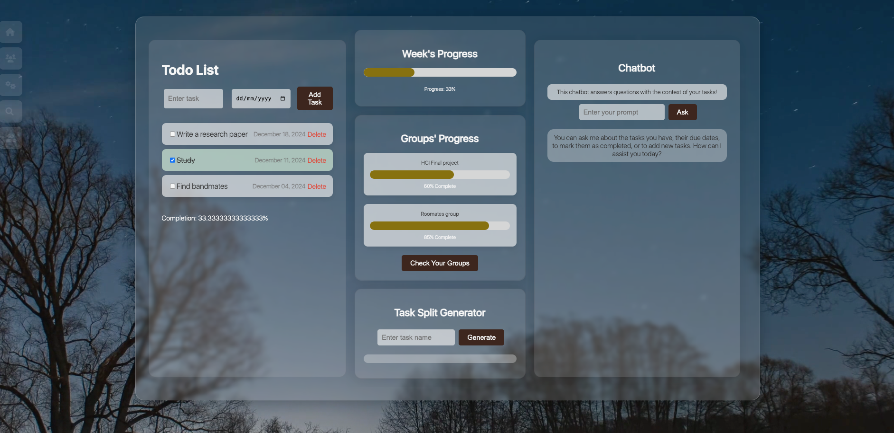
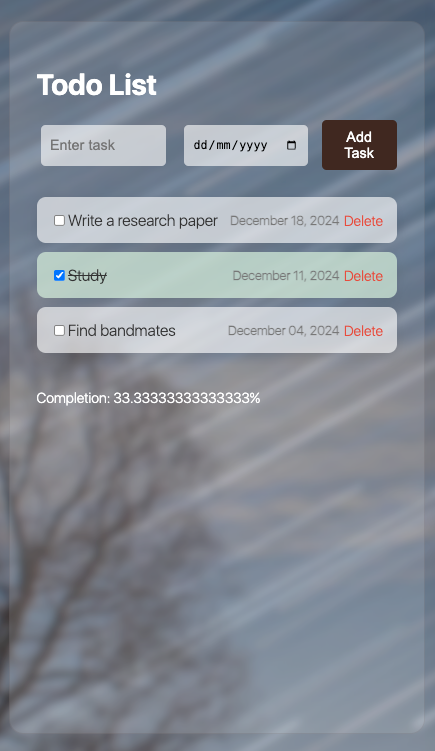
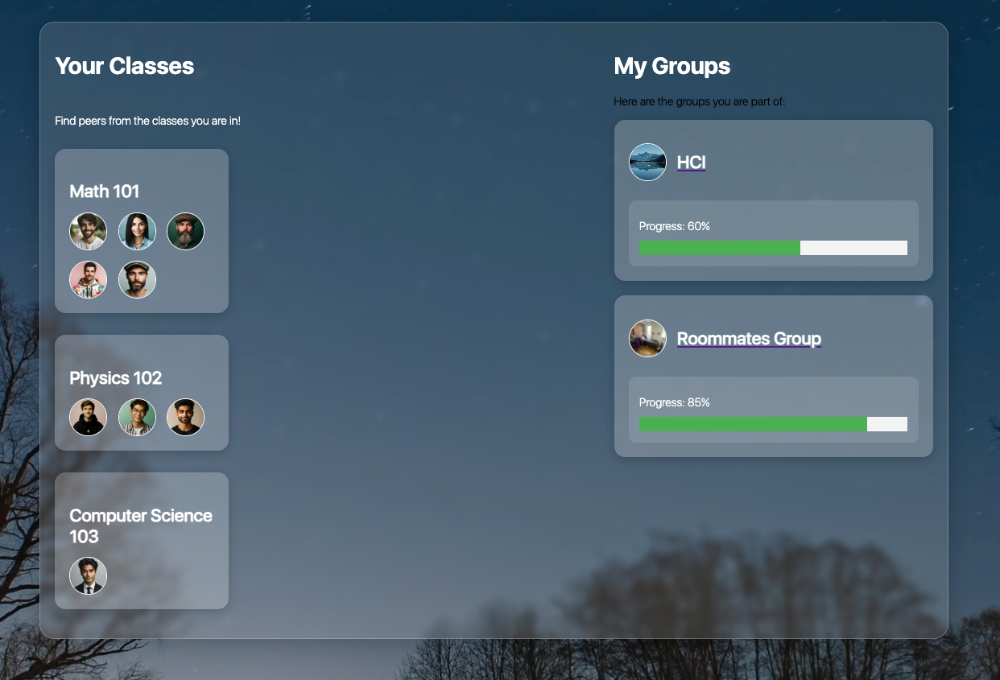

# To-Do List App

A simple web-based To-Do List application built with Flask and SQLite, allowing users to manage tasks efficiently. This app supports adding tasks with due dates, marking tasks as completed, and deleting tasks, with persistent data storage using SQLite.

---

## Features

- 📝 **Add Tasks**: Users can create tasks with optional due dates.
- ✅ **Mark Tasks as Completed**: Users can mark tasks as completed, with visual updates to indicate completion.
- 🗑️ **Delete Tasks**: Allows users to remove tasks from the list.
- 💾 **Persistent Storage**: All tasks are saved using SQLite, ensuring data remains available after refreshing or closing the app.
- 🖼️ **Dynamic UI**: The task status is dynamically updated in the user interface.
- 💬 **AI Chatbot**: An AI-powered chatbot to assist users with queries and facilitate task management.
- 🤝 **Peer Grouping**: Facilitates grouping with course mates for academic collaborations.
- 🏠 **Roommate Task Management**: Enables users to add and manage tasks specifically designed for roommates.
- 📞 **Real-time Chat**: Provides a platform for users to chat with course mates and roommates, enhancing communication and collaboration.


---

## Technologies Used

- **Flask**: Python web framework for routing and backend logic.
- **SQLite**: Lightweight database to store task data.
- **HTML/CSS**: Structure and style the user interface.
- **JavaScript**: Add interactivity for task completion and deletion.
- **Python**: Core language for backend logic.

---

## Screenshots

### Main Interface

*The main interface of the To-Do List app where users can view and manage their tasks.*

### Task Management

*Here users can add new tasks, mark them as completed, or delete them.*

### Collaborating with Classmates

*The interface for connecting with classmates and managing group tasks.*

---

## How to Use

1. **Add a Task**: 
   - Enter a task name in the input field.
   - Optionally, add a due date using the date picker.
   - Click the "Add Task" button to add the task to your list.

2. **Mark a Task as Completed**:
   - To mark a task as completed, click the checkbox next to the task.
   - The task will be visually updated with a strike-through and a different color to indicate it is completed.

3. **Delete a Task**:
   - To delete a task, click the red "Delete" button next to the task.
   - The task will be removed from the list permanently.

4. **Persistent Storage**:
   - All tasks are stored in an SQLite database, so they will persist even after closing the browser or restarting the app.

5. **Using the AI Chatbot**:
   - Interact with the AI chatbot through the chat interface for help with tasks or general inquiries.

6. **Grouping with Peers**:
   - Use the 'Group' feature to connect and collaborate with course mates on joint tasks or projects.

7. **Manage Roommate Tasks**:
   - Add and manage tasks that are specifically for your living arrangements with roommates.

8. **Real-time Chat**:
   - Use the chat feature to communicate in real-time with your course mates and roommates.

9. **Run the App Locally**:
   - Clone the repository:
     ```bash
     git clone https://github.com/JuJams/ToDoListApp.git
     ```
   - Navigate to the project folder and install the dependencies:
     ```bash
     pip install -r requirements.txt
     ```
   - Start the Flask server:
     ```bash
     python app.py
     ```
   - Open your browser and go to:
     ```
     http://127.0.0.1:5000
     ```
---

## Future Improvements

- **User Authentication**: Add user accounts so each user can manage their own tasks.
- **Task Prioritization**: Allow users to set task priorities (high, medium, low) for better organization.
- **Category Management**: Implement categories or tags for tasks (e.g., Work, Personal, School) for better task sorting.
- **Search and Filter**: Add a search bar or filter option to quickly find tasks.
- **Reminders and Notifications**: Integrate email or in-app notifications for upcoming or overdue tasks.
- **Task Archive**: Allow users to archive completed tasks instead of deleting them outright.
- **Dark Mode**: Implement a dark mode for a more customizable and visually appealing experience.
- **Deploy to Cloud**: Deploy the app on a cloud platform like **Heroku**, **AWS**, or **Google Cloud** so it can be accessed online by anyone.
- **Responsive Design**: Improve the UI to be fully responsive and mobile-friendly.
